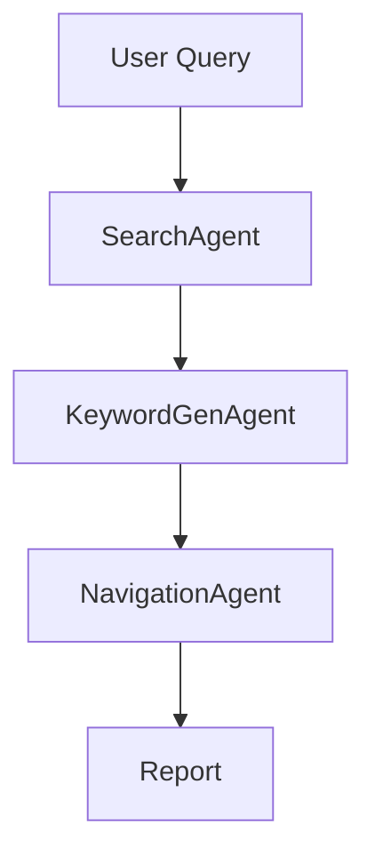

# chat_amrop_v1

---

# 🔎 LinkedIn Discovery Multi-Agent

Sistema **multi-agente en Python** que permite descubrir perfiles de **LinkedIn** a partir de una consulta del usuario.

El sistema:

1. Busca personas en Google
2. Genera queries optimizadas para LinkedIn
3. Navega automáticamente en Google
4. Extrae URLs de perfiles encontrados

El resultado final es un **reporte con perfiles de LinkedIn descubiertos**.

---

# 🧠 Arquitectura

El sistema usa **Google ADK** para coordinar agentes de IA.



Los agentes se ejecutan de forma **secuencial** mediante un **Root Agent**. 

---

# ⚙️ Flujo del sistema

### 1️⃣ Usuario realiza una consulta

Ejemplo:

```
Top gerentes de Antamina
```

---

### 2️⃣ SearchAgent

Busca en Google y extrae nombres de personas.

Ejemplo de salida:

```
Luis Santivañez
Abraham Chahuan
Adolfo Heeren
```

Salida almacenada en:

```
search_output
```

---

### 3️⃣ KeywordGenAgent

Convierte los nombres en **queries optimizadas para LinkedIn**.

Ejemplo:

```
site:pe.linkedin.com/in "Luis Santivañez"
site:pe.linkedin.com/in "Abraham Chahuan"
```

Las queries se guardan en el estado interno del agente para el proceso de navegación. 

---

### 4️⃣ NavigationAgent

Ejecuta las búsquedas en el navegador y extrae perfiles.

Por cada query:

1. Construye la URL de búsqueda
2. Abre Google
3. Extrae enlaces de LinkedIn
4. Guarda resultados

---

### 5️⃣ Reporte final

El sistema genera un reporte con los perfiles encontrados.

Ejemplo:

```
Luis Santivañez
- linkedin.com/in/luis-santivanez-123
- linkedin.com/in/luis-santivanez-456

Abraham Chahuan
- linkedin.com/in/abraham-chahuan-789
```

---

# 🤖 Agentes del sistema

## SearchAgent

Busca personas relacionadas con la consulta del usuario usando Google.

Herramienta:

```
google_search
```

---

## KeywordGenAgent

Convierte nombres en queries de búsqueda para LinkedIn.

Herramientas:

```
generar_keywords
reset_nav_state
```

---

## NavigationAgent

Navega en Google y extrae URLs de perfiles LinkedIn.

Herramientas principales:

```
build_google_search_url
go_to_url
extract_linkedin_profiles
save_query_result
```

---

# 📁 Estructura del proyecto

```
lkn_scraper_agent/

agent.py
instructions.py
tools_buscador.py
tools_navegacion.py
.env
```

---

# 🛠 Tecnologías

| Tecnología | Uso                     |
| ---------- | ----------------------- |
| Python     | Lenguaje principal      |
| Google ADK | Orquestación de agentes |
| Gemini     | Modelo LLM              |
| Selenium   | Navegación automática   |
| dotenv     | Variables de entorno    |

---

# 🔑 Variables de entorno

Archivo `.env`

```
GOOGLE_GENAI_MODEL=gemini-2.5-flash
DISABLE_WEB_DRIVER=0
```

---

# 🚀 Resultado

Pipeline completo:

```
User Query
   ↓
SearchAgent
   ↓
KeywordGenAgent
   ↓
NavigationAgent
   ↓
LinkedIn Profiles Report
```

---
